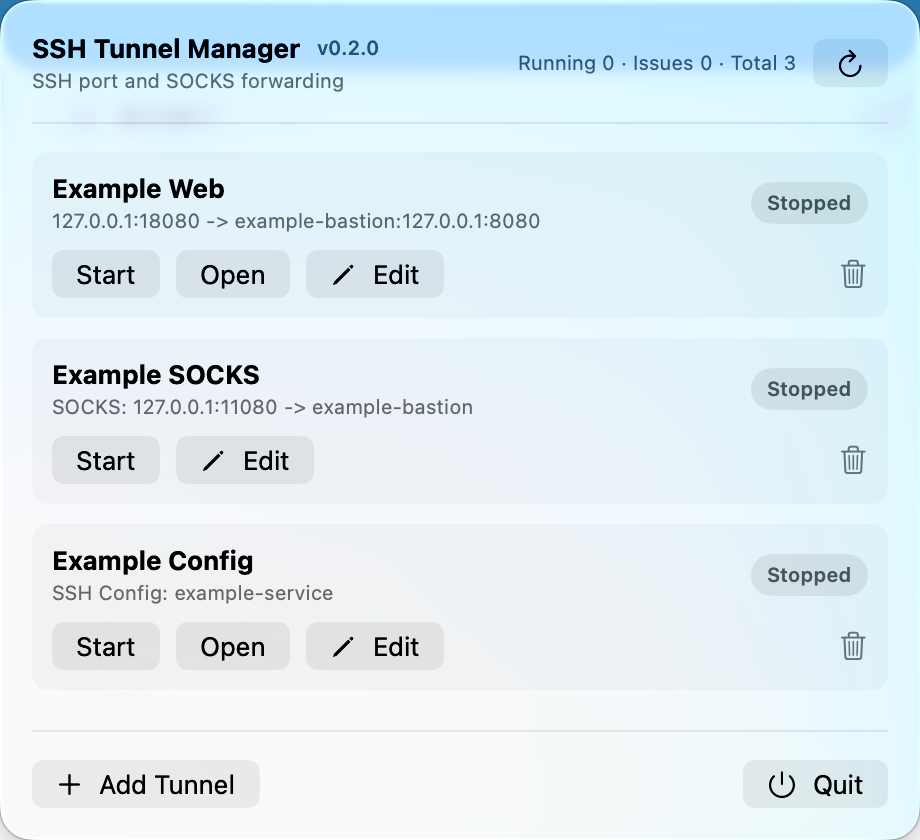
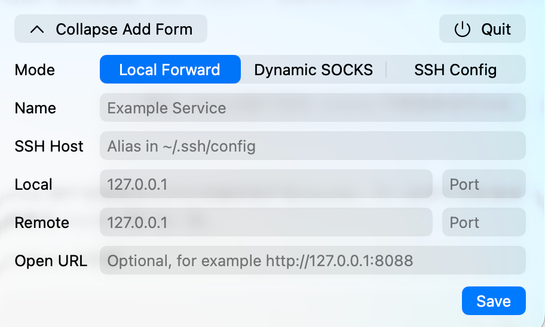

# mac-ssh-tunnel-manager

English | [中文](README.md)

A lightweight macOS menu bar app for managing SSH local port forwarding and dynamic SOCKS tunnels.

Current version: `0.2.0`

The app name is `SSH Tunnel Manager`; the SwiftPM executable target remains `ssh-tunnel-manager`.

## Features

- Runs as a SwiftUI `MenuBarExtra` menu bar app.
- Starts tunnels by calling `/usr/bin/ssh` directly, without shell command string assembly.
- Reuses your existing `~/.ssh/config`, ssh-agent, and macOS Keychain behavior.
- Stores tunnel definitions as local JSON.
- Does not store server passwords or private keys.
- Ships with no built-in tunnel presets.
- Supports English and Simplified Chinese UI, following the macOS system language.

## Screenshots





## Requirements

- macOS 14 or later.
- Xcode 26 or a compatible Swift 6 toolchain.
- SSH Config mode requires a matching `Host` entry in your own `~/.ssh/config`.

## Run From Source

For development:

```bash
swift run ssh-tunnel-manager
```

You can also open `Package.swift` in Xcode and run the `ssh-tunnel-manager` executable target.

## Install Locally

To install it as a normal macOS app that can be launched from Finder, Spotlight, or Launchpad:

```bash
./scripts/install-app.sh
```

The script builds a release binary, creates `SSH Tunnel Manager.app`, signs it with local ad-hoc signing, and installs it to:

```text
/Applications/SSH Tunnel Manager.app
```

If an older copy is still running in the menu bar after installation, quit it from the app menu and reopen it. You can also launch it from the command line:

```bash
open -a 'SSH Tunnel Manager'
```

## Package For Distribution

For small trusted distribution:

```bash
./scripts/package-app.sh
```

The zip package is written to:

```text
dist/SSH Tunnel Manager-0.2.0.zip
```

The generated app is ad-hoc signed and is not notarized with an Apple Developer ID. On first launch, macOS may ask the user to approve the app from Finder or from System Settings > Privacy & Security.

## Test

```bash
swift test
```

## Documentation

- [Architecture](docs/architecture.en.md)
- [Distribution](docs/distribution.en.md)
- [Privacy notes](docs/privacy.en.md)
- [Troubleshooting](docs/troubleshooting.en.md)
- [Release process](docs/release.en.md)
- [Changelog](CHANGELOG.en.md)
- [Contributing](CONTRIBUTING.en.md)
- [Security policy](SECURITY.en.md)
- [License](LICENSE)

## Configuration File

Tunnel definitions are stored at:

```text
~/Library/Application Support/ssh-tunnel-manager/tunnels.json
```

Each tunnel can include these fields:

- `name`
- `mode`
- `sshHost`
- `localHost`
- `localPort`
- `remoteHost`
- `remotePort`
- `sshConfigName`
- `openURL`

The app starts with an empty tunnel list. Add tunnels from the menu bar UI.

## Usage

Click "Add Tunnel" and choose one mode. The examples below use sanitized host names and documentation-only addresses. Replace them with real `Host` aliases from your own `~/.ssh/config`.

### Local Forward

Use this when you want to expose one fixed remote service on a local port, such as a web service, database, or admin port.

```text
Mode: Local Forward
Name: Example Service
SSH Host: example-bastion
Local: 127.0.0.1 18080
Remote: 127.0.0.1 8080
Open URL: http://127.0.0.1:18080
```

If the local bind address is not a loopback address, the app asks for confirmation before saving or starting the tunnel.

The app starts SSH with:

```bash
/usr/bin/ssh -N \
  -o ExitOnForwardFailure=yes \
  -o ServerAliveInterval=30 \
  -L localHost:localPort:remoteHost:remotePort \
  sshHost
```

### Dynamic SOCKS

Use this when you want a temporary SOCKS proxy over SSH for command-line tools or apps that support SOCKS proxies. The app only keeps the local SOCKS listener running; it does not modify system proxy settings or Git configuration.

```text
Mode: Dynamic SOCKS
Name: Example SOCKS
SSH Host: example-bastion
SOCKS: 127.0.0.1 1080
Open URL: blank
```

The app starts SSH with:

```bash
/usr/bin/ssh -N \
  -o ExitOnForwardFailure=yes \
  -o ServerAliveInterval=30 \
  -D localHost:localPort \
  sshHost
```

Example one-off Git command:

```bash
ALL_PROXY=socks5h://127.0.0.1:1080 git fetch
```

Keep the SOCKS bind address at `127.0.0.1` unless LAN access is intentional. The app asks for confirmation before using a non-loopback address because other devices may be able to access the proxy.

### SSH Config

Use this when the forwarding rule already lives in `~/.ssh/config`. The app only stores the SSH config alias and does not edit your SSH config file.

```sshconfig
Host example-service
  HostName 203.0.113.10
  User appuser
  LocalForward 127.0.0.1:18080 127.0.0.1:8080
```

```text
Mode: SSH Config
Name: Example Service
SSH Config: example-service
Open URL: http://127.0.0.1:18080
```

The app starts SSH with:

```bash
/usr/bin/ssh -N \
  -o ExitOnForwardFailure=yes \
  -o ServerAliveInterval=30 \
  sshConfigName
```

SSH Config mode requires the selected `Host` to contain at least one `LocalForward`.

The app also checks the resolved `LocalForward` bind address and asks for confirmation when it is not a loopback address.

## Safety Boundary

The app only stops SSH processes that it started and tracks itself. It does not search for, attach to, or terminate SSH processes started manually outside the app.
