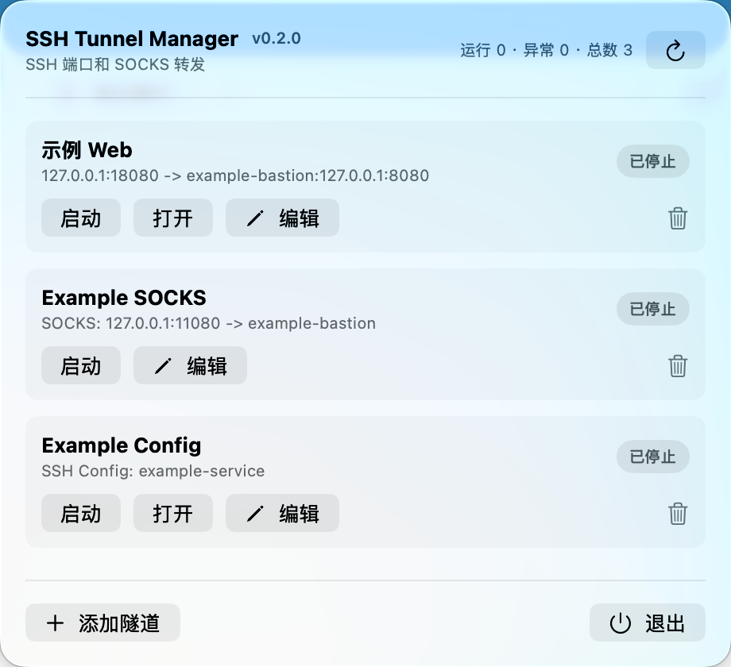
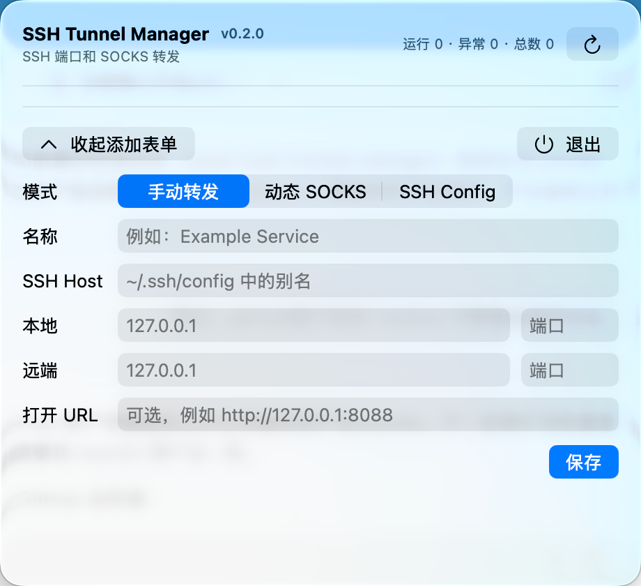

# mac-ssh-tunnel-manager

[English](README.en.md) | 中文

用于管理 SSH 本地端口转发、远程端口转发和动态 SOCKS 隧道的 macOS 菜单栏应用。

当前版本：`0.3.2`

应用名称为 `SSH Tunnel Manager`，SwiftPM executable target 为 `ssh-tunnel-manager`。

应用保持轻量：

- 使用 AppKit 状态栏项目和 SwiftUI 主界面运行在菜单栏，不显示 Dock 图标。
- 默认启用全局快捷键 `⌃⌥⌘T`，菜单栏图标被隐藏时仍可展示并置前主界面。
- 启动隧道时直接调用 `/usr/bin/ssh`，不经过 shell 字符串拼接。
- 复用系统已有的 `~/.ssh/config`、ssh-agent 和 macOS Keychain 行为。
- 隧道配置以 JSON 保存在本机。
- 支持通过标签、收藏、搜索和排序快速定位隧道配置。
- 支持为单条隧道启用自动重连，并在断网或睡眠恢复后按退避策略恢复。
- 支持默认关闭的连接失败/恢复通知，以及不含配置名称、Host、端口目标和原始 stderr 的可复制诊断信息。
- 不保存服务器密码或私钥。
- 不内置任何默认隧道配置。
- 界面支持英文和简体中文，默认跟随 macOS 系统语言。

## 界面截图





## 环境要求

- macOS 14 或更高版本。
- Xcode 26 或兼容的 Swift 6 工具链。
- 如果要使用 SSH Config 模式，需要先在 `~/.ssh/config` 中配置对应 SSH Host。

## 运行

开发调试时可以直接运行：

```bash
swift run ssh-tunnel-manager
```

也可以用 Xcode 打开 `Package.swift`，运行 `ssh-tunnel-manager` executable target。

## 安装到应用程序

需要像普通 macOS 应用一样从 Finder、Spotlight 或 Launchpad 启动时，运行：

```bash
./scripts/install-app.sh
```

脚本会执行 release 构建，生成 `SSH Tunnel Manager.app`，进行本机 ad-hoc 签名，并安装到：

```text
/Applications/SSH Tunnel Manager.app
```

以后代码没有变化时，直接点击应用图标启动即可。更新代码后，再运行一次安装脚本覆盖安装新版。

如果菜单栏中旧版本仍在运行，覆盖安装后需要先在应用里点“退出”，再从 Finder、Spotlight、Launchpad 或命令行重新打开：

```bash
open -a 'SSH Tunnel Manager'
```

## 打包分发

小范围发给别人使用时，可以生成 zip 包：

```bash
./scripts/package-app.sh
```

产物会输出到：

```text
dist/SSH Tunnel Manager-0.3.2.zip
```

对方解压后，把 `SSH Tunnel Manager.app` 拖到 `/Applications`，再从 Finder、Spotlight 或 Launchpad 打开。

当前 zip 包使用本机 ad-hoc 签名，没有 Apple Developer ID notarization。第一次打开时 macOS 可能提示无法验证开发者，用户需要右键点击应用选择“打开”，或在“系统设置 > 隐私与安全性”中允许打开。

## 测试

```bash
swift test
```

## 文档

- [架构说明](docs/architecture.md)
- [全局快捷键备用入口需求](docs/requirements-global-shortcut.md)
- [全局快捷键备用入口技术设计](docs/design-global-shortcut.md)
- [全局快捷键备用入口验收记录](docs/validation-global-shortcut.md)
- [配置组织功能验收记录](docs/validation-config-organization.md)
- [自动重连与网络、睡眠恢复验收记录](docs/validation-auto-reconnect.md)
- [连接通知与诊断验收记录](docs/validation-connection-notifications.md)
- [分发说明](docs/distribution.md)
- [隐私说明](docs/privacy.md)
- [排障手册](docs/troubleshooting.md)
- [发布流程](docs/release.md)
- [更新日志](CHANGELOG.md)
- [贡献指南](CONTRIBUTING.md)
- [贡献者行为准则](CODE_OF_CONDUCT.md)
- [安全政策](SECURITY.md)
- [许可证](LICENSE)

## 配置文件

应用会把隧道定义写入：

```text
~/Library/Application Support/ssh-tunnel-manager/tunnels.json
```

全局快捷键设置独立保存到：

```text
~/Library/Application Support/ssh-tunnel-manager/settings.json
```

连接通知设置独立保存到：

```text
~/Library/Application Support/ssh-tunnel-manager/connection-notifications.json
```

每条隧道保存以下字段：

- `name`
- `mode`
- `sshHost`
- `localHost`
- `localPort`
- `remoteHost`
- `remotePort`
- `sshConfigName`
- `openURL`
- `tags`：最多 10 个标签，每个标签最多 32 个字符，按大小写不敏感方式去重。
- `isFavorite`：收藏状态。
- `manualOrder`：稳定的手工排序序号。
- `lastUsedAt`：最近一次成功启动 SSH 进程的时间。
- `isAutoReconnectEnabled`：是否在可恢复故障后自动重连；旧版 JSON 缺少该字段时默认为 `false`。

旧版 JSON 不包含上述组织字段或自动重连字段时使用兼容默认值，并以原 JSON 数组顺序作为初始手工顺序。

首次保存远程转发配置前，如果已经存在旧版 `tunnels.json`，应用会原样创建一次性恢复备份：

```text
~/Library/Application Support/ssh-tunnel-manager/tunnels.json.pre-remote-forward.bak
```

## 配置查找与排序

主界面支持：

- 搜索名称、标签、模式、SSH Host 或 SSH Config 别名和当前模式实际使用的端口文本。
- 组合使用标签筛选、仅收藏筛选和搜索条件，并显示结果数量。
- 按手工顺序、名称、运行状态或最近使用时间排序。
- 在未启用搜索、标签或收藏筛选时，通过上下箭头调整手工顺序。

筛选和排序只改变展示结果，不会启动、停止、编辑或删除被隐藏的隧道。手工顺序、标签、收藏和最近使用时间都会随配置保存；写盘失败时界面恢复为修改前状态并显示错误。

## 自动重连

每条配置可以独立启用“自动重连”，默认关闭。启用后，可恢复的 SSH 连接故障按 2、5、10、30、60 秒退避重试，后续失败保持 60 秒上限；连续稳定运行 5 分钟后重新从 2 秒开始计数。

断网和系统睡眠期间不会重试。网络恢复或系统唤醒后，应用等待网络稳定 2 秒再恢复连接。等待网络、等待重连或正在连接时点击“停止”，都会取消运行意图和待执行任务，之后不会自行重启。认证失败、Host Key 校验失败、监听端口冲突和配置错误会直接进入失败状态，需要修复后手工启动；自动恢复期间的 SSH Config 瞬时校验超时会继续下一档退避。

## 连接通知与诊断

连接通知默认关闭。只有在设置中主动启用时，应用才请求 macOS 通知权限；拒绝权限不会影响隧道运行。每个连续故障周期最多发送一次失败通知和一次恢复通知，恢复通知会在 SSH 进程稳定运行 2 秒后发送；面板打开时也会正常展示前台通知。用户主动停止、编辑、删除或退出应用不会触发掉线通知。

每条隧道的“连接详情”会显示状态变化时间、退出码、重试次数、下次重试时间、错误类别和已脱敏错误摘要。“复制诊断信息”仅复制应用版本、macOS 版本、CPU 架构、隧道模式、状态、时间、退出码、重试信息和错误类别，不包含配置名称、Host/IP、用户名、端口目标、私钥路径、完整 SSH 命令或原始 stderr。

首次启动时列表为空，需要在菜单栏界面中手动添加隧道。

## 全局快捷键

应用运行时，按 `⌃⌥⌘T` 可以展示并置前主界面；主界面已经显示时再次按下快捷键会将其关闭。

点击主界面顶部的齿轮按钮可以：

- 启用或停用全局快捷键。
- 录制自定义组合键。
- 恢复默认组合 `⌃⌥⌘T`。
- 查看当前注册状态并在失败后重试。

保存前应用会检查已启用的 macOS 系统级快捷键，并尝试独占注册候选组合。已确认冲突会阻止保存，旧快捷键继续有效。macOS 不能完整枚举其他应用内部或非独占的快捷键，因此冲突检测不能覆盖所有第三方应用。

全局快捷键只能在应用运行时使用。如果快捷键注册失败且菜单栏图标不可见，可以再次从 Finder、Spotlight、Launchpad 打开应用，或运行：

```bash
open -a 'SSH Tunnel Manager'
```

## 使用方式

点击“添加隧道”后选择一种模式。以下示例均使用脱敏 Host 和保留地址，需要替换为自己 `~/.ssh/config` 中真实可用的 Host 别名。

### 手动转发

适合把远端某个固定服务映射到本机端口，例如远端 Web、数据库或管理端口。

```text
模式：手动转发
名称：Example Service
SSH Host：example-bastion
本地：127.0.0.1 18080
远端：127.0.0.1 8080
打开 URL：http://127.0.0.1:18080
```

如果本地监听地址不是回环地址，保存或启动时应用会先提示可能的局域网暴露风险，确认后才继续。

### 远程转发

适合让 SSH 服务器通过隧道访问 Mac 本机或 Mac 可访问的服务，例如临时展示本地开发服务。

```text
模式：远程转发
名称：Example Reverse
SSH Host：example-bastion
远端监听：localhost 18080
本地目标：127.0.0.1 3000
打开 URL：留空
```

远端监听默认为 `localhost`。使用非回环地址或 `*` 时，应用会显示包含当前地址和端口的风险确认，并提示服务端 `GatewayPorts` 可能扩大实际监听范围。远程转发只显示 SSH 进程运行状态，不使用 Mac 本地的 `lsof` 推断远端端口是否监听。

### 动态 SOCKS

适合临时给命令行工具或支持 SOCKS 的应用走 SSH 代理。应用只负责启动本地 SOCKS 监听，不会自动修改系统代理或 Git 配置。

```text
模式：动态 SOCKS
名称：Example SOCKS
SSH Host：example-bastion
SOCKS：127.0.0.1 1080
打开 URL：留空
```

启动后，需要使用 SOCKS 的命令或应用自行指定代理，例如：

```bash
ALL_PROXY=socks5h://127.0.0.1:1080 git fetch
```

建议将 SOCKS 监听地址保持为 `127.0.0.1`。如果使用非回环地址，应用会在保存或启动前要求确认，因为局域网设备可能访问这个代理。

### SSH Config

适合复用 `~/.ssh/config` 中已经写好的 `LocalForward`。应用只保存 Host 别名，不会自动编辑 SSH 配置。

```sshconfig
Host example-service
  HostName 203.0.113.10
  User appuser
  LocalForward 127.0.0.1:18080 127.0.0.1:8080
```

```text
模式：SSH Config
名称：Example Service
SSH Config：example-service
打开 URL：http://127.0.0.1:18080
```

## SSH 命令结构

手动转发模式下，应用从字段生成参数：

```bash
/usr/bin/ssh -N \
  -o ExitOnForwardFailure=yes \
  -o ServerAliveInterval=30 \
  -L localHost:localPort:remoteHost:remotePort \
  sshHost
```

远程转发模式下，应用从字段生成参数：

```bash
/usr/bin/ssh -N \
  -o ExitOnForwardFailure=yes \
  -o ServerAliveInterval=30 \
  -R remoteHost:remotePort:localHost:localPort \
  sshHost
```

SSH Config 模式下，应用直接使用 `~/.ssh/config` 中已有 Host：

```bash
/usr/bin/ssh -N \
  -o ExitOnForwardFailure=yes \
  -o ServerAliveInterval=30 \
  sshConfigName
```

SSH Config 模式要求对应 Host 至少配置一条 `LocalForward`，例如：

```sshconfig
Host example-service
  HostName 203.0.113.10
  User appuser
  LocalForward 127.0.0.1:18080 127.0.0.1:8080
```

应用会检查解析后的 `LocalForward` 绑定地址；如果不是回环地址，保存或启动时会提示风险并要求确认。

在应用中选择 `SSH Config` 模式后，只需要填写：

```text
名称：Example Service
SSH Config：example-service
打开 URL：http://127.0.0.1:18080
```

动态 SOCKS 模式下，应用从字段生成 `-D` 参数：

```bash
/usr/bin/ssh -N \
  -o ExitOnForwardFailure=yes \
  -o ServerAliveInterval=30 \
  -D localHost:localPort \
  sshHost
```

应用只会停止自己启动的 SSH 进程，不会误杀用户手动打开的 SSH 连接。
