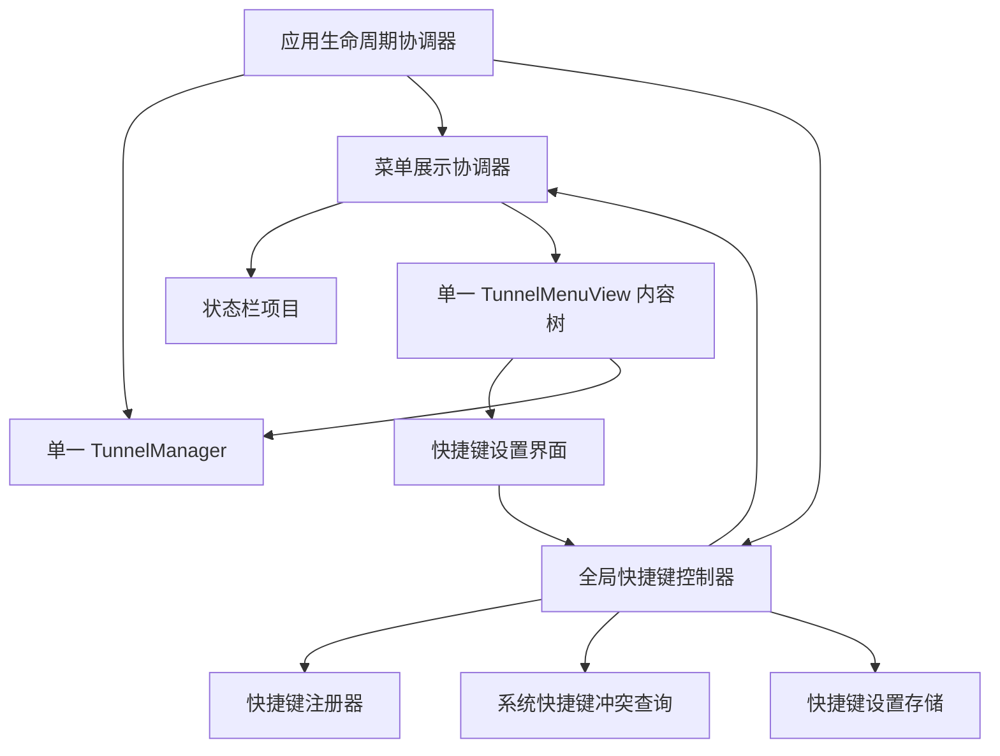

# 全局快捷键备用入口技术设计

## 文档状态

- 状态：已实现并完成核心场景验收
- 对应需求：[全局快捷键备用入口需求](requirements-global-shortcut.md)
- 适用平台：macOS 14 及以上
- 设计目标：在不引入敏感权限和不复制隧道运行状态的前提下，实现可配置、可检测部分冲突、可回滚的全局快捷键备用入口。

## 设计摘要

本设计采用以下总体方案：

1. 使用 macOS Carbon 事件接口注册全局快捷键，通过独占试注册识别系统能够确认的进程间冲突。
2. 保存前查询已启用的 macOS 系统级符号快捷键，补充系统快捷键冲突检测。
3. 不引入第三方快捷键依赖；Carbon 调用集中封装，避免系统接口扩散到业务层。
4. 快捷键配置独立保存到 `settings.json`，使用原子写入和用户私有权限，失败时可以保留旧快捷键。
5. 使用单一 `TunnelManager` 和单一 `TunnelMenuView` 内容树；菜单栏点击、全局快捷键和应用重新打开请求都交给同一个展示协调器。
6. 展示层采用 `NSStatusItem + NSPanel`。`NSPopover` 的公开接口必须锚定状态栏按钮，不能显式指定鼠标所在显示器，因此未选择该路线。

## 立项与实现依据

### 已验证事实

- 改造前 `Sources/SSHTunnelManagerApp/SSHTunnelManagerApp.swift` 使用 SwiftUI `MenuBarExtra`；最终实现改由 AppDelegate 组装 `NSStatusItem + NSPanel`，主界面宽度为 460 点。
- `TunnelManager` 是 `@MainActor` 的 `ObservableObject`，负责隧道配置和 SSH 进程生命周期；应用退出时会停止本应用管理的 SSH 进程。
- `TunnelMenuView` 通过 `@EnvironmentObject` 使用 `TunnelManager`，自身只保留表单展开和草稿等视图状态。
- 菜单栏使用 `TunnelManager.menuSystemImage` 动态生成纯图标，`TunnelManager.menuTitle` 用于悬浮提示和辅助功能标签。
- 应用包设置 `LSUIElement=true`，不显示 Dock 图标。
- 项目当前没有第三方 Swift Package 依赖，最低支持 macOS 14。
- `TunnelConfigStore` 已采用 JSON 原子写入，并把目录和文件权限分别收紧为 `0700` 和 `0600`。
- 当前 Xcode macOS SDK 提供 `RegisterEventHotKey`、`UnregisterEventHotKey` 和 `CopySymbolicHotKeys`。系统接口能够报告部分独占注册冲突，但不能枚举其他应用内部的普通命令快捷键。

### 立项时关键验证点（已完成）

立项时没有代码证明 SwiftUI `MenuBarExtra` 可以从全局事件稳定打开，也没有证明 AppKit 弹窗的定位行为。实现阶段完成展示原型并选择 `NSStatusItem + NSPanel`；普通桌面场景已验收，多显示器和全屏空间仍保留为实机验收项。

## 设计原则

- **单一状态源**：全应用只创建一个 `TunnelManager`。
- **先保旧值再试新值**：候选快捷键未完成注册和持久化前，旧快捷键持续有效。
- **能力边界诚实**：只把系统快捷键匹配和明确的独占注册失败称为已确认冲突。
- **不监听普通输入**：全局触发使用系统快捷键事件；只有用户主动进入录制状态时才短时读取下一次组合键，完成或取消后立即停止。
- **无敏感权限**：不请求辅助功能或输入监控权限，不模拟鼠标键盘操作。
- **系统接口隔离**：Carbon 类型和状态码只存在于 App 层适配器中，Core 层只处理可测试的数据模型。
- **失败可恢复**：快捷键失败不能影响菜单栏入口、应用重新打开入口、隧道配置或 SSH 进程。

## 总体架构



职责边界：

- 生命周期协调器只负责组装依赖、启动注册、重新打开应用和退出清理。
- 菜单展示协调器只负责状态栏项目以及主界面的展示、置前和关闭。
- 全局快捷键控制器只负责设置状态、校验、冲突检测、保存事务和事件路由。
- 快捷键注册器只负责系统注册和注销，不读写配置、不直接操作界面。
- 快捷键设置存储只负责配置文件，不依赖 AppKit 或 Carbon。
- `TunnelManager` 不感知快捷键设置，避免把入口能力混入 SSH 业务逻辑。

## 展示层方案与决策门

### 不继续直接使用 `MenuBarExtra` 的原因

改造前项目只能通过用户点击 `MenuBarExtra` 标签打开窗口，没有可测试的项目内控制接口。通过枚举 SwiftUI 私有窗口、查找私有视图层级或模拟状态栏点击实现全局入口都不稳定，并违反不使用私有 API、不使用模拟点击的约束。

### 候选方案 A：`NSStatusItem + NSPopover`

这是首选路线：

- 使用 `NSStatusBar.system.statusItem` 创建状态栏项目。
- 使用 `NSHostingController` 承载现有 `TunnelMenuView`。
- 使用 `NSPopover` 提供接近现有 `.menuBarExtraStyle(.window)` 的弹出体验。
- 菜单栏点击和全局快捷键都采用显示/关闭切换行为。
- `NSPopover.behavior` 使用瞬时关闭行为，点击其他应用后自动关闭。

优点是状态栏交互和弹窗关闭语义接近现状；主要不确定性是程序触发时能否稳定出现在鼠标所在显示器，以及全屏空间中的表现。

### 候选方案 B：`NSStatusItem + NSPanel`

当候选方案 A 未通过显示器或全屏验收时使用：

- 使用可成为关键窗口的轻量 `NSPanel` 承载同一个 `TunnelMenuView`。
- 菜单栏点击时根据状态栏按钮屏幕坐标定位。
- 全局快捷键和应用重新打开请求触发时，根据 `NSEvent.mouseLocation` 选择显示器，并把窗口定位在该显示器可见区域顶部。
- 面板已经可见时只执行激活、置前和聚焦，不创建新窗口。
- 面板失去应用激活状态时关闭；菜单栏图标点击仍保持原有打开或关闭行为。
- 使用公开窗口级别和 Space 行为支持全屏辅助展示，不使用私有窗口级别。

该路线定位更可控，但需要额外验证焦点、点击外部关闭、设置表单输入和菜单栏图标切换行为。

### 最小原型验证

开发第一步只实现临时展示原型，不接入快捷键配置和 SSH 逻辑。原型使用一个简单 SwiftUI 测试视图，依次验证：

1. 其他应用在前台时可以通过程序调用展示并获得键盘焦点。
2. 弹窗已经可见时再次触发快捷键会关闭，不创建第二个窗口。
3. 弹窗被其他窗口遮挡时可以置前。
4. 鼠标位于外接显示器时，弹窗出现在该显示器。
5. 当前应用处于全屏空间时，弹窗出现在当前空间。
6. 菜单栏图标点击仍可打开和关闭，点击其他应用后弹窗按预期消失。
7. 文本输入、SwiftUI `sheet` 和键盘焦点可用。
8. 全过程不出现辅助功能或输入监控授权提示。

决策规则：

- 方案 A 全部通过时采用方案 A。
- 方案 A 只要在当前显示器、全屏空间或置前行为中任一项失败，就验证方案 B。
- 方案 B 全部通过时采用方案 B。
- 两个方案都不能在无敏感权限、无私有 API 条件下满足要求时停止开发，记录失败证据并重新评审需求，不继续堆叠窗口查找或模拟点击补丁。

原型代码只用于验证，不直接混入最终架构；选型后删除临时入口和测试按钮。

## 应用生命周期与依赖组装

### 生命周期所有权

最终实现由一个 `@MainActor` 应用生命周期协调器持有以下长生命周期对象：

- 一个 `TunnelManager`；
- 一个菜单展示协调器；
- 一个全局快捷键控制器；
- 一个快捷键注册器；
- 一个快捷键设置存储。

`SSHTunnelManagerApp` 使用 `NSApplicationDelegateAdaptor` 接入 AppKit 生命周期。最终 Scene 不再负责创建第二个 `TunnelManager`，也不能为了满足 SwiftUI Scene 声明额外创建可见主窗口。

初始化顺序：

1. 创建 `TunnelManager`。
2. 创建状态栏项目和菜单展示协调器，先保证菜单入口可用。
3. 创建设置存储和快捷键控制器。
4. 读取设置并尝试启动注册。
5. 把快捷键成功事件路由到菜单展示协调器。

该顺序保证快捷键启动注册失败时，菜单栏入口和应用重新打开恢复入口已经存在。

### 应用重新打开

生命周期协调器处理应用重新打开请求。对已经运行的应用执行以下命令时：

```bash
open -a 'SSH Tunnel Manager'
```

应用只展示并置前已有主界面，不创建第二个进程内状态对象。该路径需要纳入最小原型和真实应用包验收。

### 退出

现有 `TunnelManager.prepareForApplicationTermination()` 保持不变。退出顺序新增快捷键注销：

1. 设置快捷键控制器进入终止状态，不再响应新事件。
2. 注销活动快捷键和候选快捷键。
3. 执行现有 SSH 进程停止和计时器清理。
4. 终止应用。

系统会在进程退出时清理全局快捷键注册，但应用仍显式注销，以便测试和生命周期边界清晰。

## 快捷键数据模型

### Core 层模型

建议新增以下纯 Foundation 模型：

```swift
public struct GlobalShortcut: Codable, Equatable, Sendable {
    public var keyCode: UInt32
    public var modifiers: Set<GlobalShortcutModifier>
}

public enum GlobalShortcutModifier: String, Codable, CaseIterable, Sendable {
    case control
    case option
    case command
    case shift
}

public struct GlobalShortcutSettings: Codable, Equatable, Sendable {
    public var schemaVersion: Int
    public var isEnabled: Bool
    public var shortcut: GlobalShortcut
}
```

默认值：

- `schemaVersion = 1`
- `isEnabled = true`
- `shortcut.keyCode = 17`，即当前 SDK 的 `kVK_ANSI_T`
- `shortcut.modifiers = [.control, .option, .command]`

模型不直接保存 Carbon 或 AppKit 的位掩码，避免序列化系统框架内部值。App 层适配器负责模型修饰键与系统位掩码之间的双向转换。`Set` 使用自定义 Codable 实现按固定顺序编码，保证 JSON 输出稳定。

### 文件格式

配置文件保存到：

```text
~/Library/Application Support/ssh-tunnel-manager/settings.json
```

示例：

```json
{
  "isEnabled" : true,
  "schemaVersion" : 1,
  "shortcut" : {
    "keyCode" : 17,
    "modifiers" : [
      "control",
      "option",
      "command"
    ]
  }
}
```

存储规则：

- 与 `tunnels.json` 分离，不能修改现有隧道 JSON 结构。
- 复用 `TunnelConfigStore` 的目录创建、原子写入和权限策略，但使用独立的 `GlobalShortcutSettingsStore` 类型。
- 目录权限为 `0700`，文件权限为 `0600`。
- 文件不存在时返回默认设置，不要求立即创建文件。
- 解码失败时保留原文件，运行时尝试使用默认设置，并在设置界面显示“配置异常，当前使用默认值”。只有用户成功保存后才覆盖异常文件。
- 未知 `schemaVersion` 不按当前结构强行读取，进入配置异常状态。

## 快捷键输入与显示

### 录制控件

使用 `NSViewRepresentable` 包装一个可成为 first responder 的自定义 `NSView`：

- 只有控件进入录制状态后处理 `keyDown` 和 `flagsChanged`。
- `Escape` 退出录制并保留原候选值。
- 读取 `NSEvent.keyCode` 和设备无关修饰键集合。
- 捕获完成后立即退出录制状态，但不自动保存。
- 录制期间通知快捷键控制器暂停展示动作分发；系统注册继续保留。如果收到当前活动快捷键事件，控制器直接把该组合回填为录制结果，不注销旧注册。
- 控件失去焦点或设置界面关闭时结束录制。

不使用全局键盘事件监控录制组合键。

### 有效性校验

纯逻辑校验器按以下规则返回结构化结果：

- 必须包含一个非修饰键。
- 必须至少包含 `Control`、`Option` 或 `Command` 中的一个。
- 只有 `Shift`、只有修饰键或没有修饰键时返回非法组合。
- 电源键、媒体键和无法通过选定注册接口稳定表达的键返回不支持。
- 相同修饰键去重，忽略 Caps Lock、数字键盘来源等与产品无关的标志。

### 显示格式

- 修饰键按 `⌃`、`⌥`、`⇧`、`⌘` 的固定顺序显示。
- 主键名称根据当前键盘输入源转换为可读文本；无法转换时显示稳定的键名或键码，不显示空值。
- 键盘输入源变化时只刷新显示，不修改保存的物理键码。
- 可访问性值同时提供文字形式，例如“Control Option Command T”。

## 系统注册与冲突检测

### 系统接口封装

App 层新增注册器协议：

```swift
protocol GlobalShortcutRegistering: AnyObject {
    func registerCandidate(_ shortcut: GlobalShortcut) -> Result<ShortcutRegistrationToken, ShortcutRegistrationError>
    func promoteCandidate(_ token: ShortcutRegistrationToken)
    func unregister(_ token: ShortcutRegistrationToken)
}
```

生产实现集中封装：

- `RegisterEventHotKey`
- `UnregisterEventHotKey`
- `InstallEventHandler`
- `kEventHotKeyExclusive`
- Carbon 修饰键转换和状态码映射

SwiftPM executable target 显式链接 Carbon framework。Core target 不依赖 Carbon。

Carbon 注册、注销、系统快捷键查询和事件映射都限定在 `MainActor` 执行，满足这些系统接口的线程约束。

### 事件标识与生命周期

- 应用使用固定四字符签名和进程内递增 ID 生成 `EventHotKeyID`。
- 每次候选注册使用新的 ID，注册器维护 ID 到注册令牌的映射。
- 候选注册成功但尚未提交时，事件处理器忽略该候选 ID。
- 提交后把候选令牌提升为活动令牌，不进行“注销候选后重新注册”的二次操作，避免出现新的失败窗口。
- Carbon 回调只识别事件并转交主线程；界面展示和设置状态变更均在 `MainActor` 执行。
- 事件处理器在进程内只安装一次，多次保存不得重复安装。

### 系统快捷键查询

使用 `CopySymbolicHotKeys` 获取当前系统偏好中定义的快捷键，只比较 `enabled=true` 的条目：

- 把系统键码和修饰键转换为统一模型后做精确匹配。
- 查询失败归类为“系统冲突查询失败”，不能谎报“无冲突”。用户可以重试，不进入独占试注册。
- 不显示系统快捷键名称，因为该接口不能可靠提供每个条目对应的设置名称。
- 不缓存跨保存周期的结果，每次点击保存时重新查询。

### 冲突错误分类

注册器只向控制器暴露产品级错误：

```swift
enum ShortcutRegistrationError: Equatable {
    case conflict
    case unsupported
    case systemQueryFailed(code: Int32)
    case registrationFailed(code: Int32)
}
```

- macOS 系统快捷键精确匹配返回 `.conflict`。
- 独占注册返回明确的已存在状态时返回 `.conflict`。
- 其他系统状态码返回 `.registrationFailed`，不得归类为冲突。
- 日志只记录组合键、产品级错误和数值状态码，不猜测占用方。

第三方应用采用非独占方式注册或只在应用内部处理的快捷键，系统可能无法发现。设置界面和排障文档继续保留该能力边界说明。

## 保存事务与状态机

### 状态

控制器向设置界面提供以下状态：

```swift
enum GlobalShortcutStatus: Equatable {
    case disabled
    case active(GlobalShortcut)
    case recording
    case unsaved
    case conflict(GlobalShortcut)
    case registrationFailed(GlobalShortcut, message: String)
    case invalidStoredSettings(message: String)
}
```

实现时可以拆分“运行状态”和“编辑状态”，但界面必须能够明确表达需求文档规定的各个状态，不能用一个布尔值同时表示注册成功和设置开关。

### 启用或修改快捷键

保存流程：

1. 对候选设置执行纯逻辑校验。
2. 候选值与当前值完全相同、启用状态未变化且运行时注册状态一致时直接返回无变更；如果配置为启用但当前没有活动令牌，则进入重试流程。
3. 查询已启用的系统级符号快捷键。
4. 保持旧活动令牌不变，独占注册候选组合。
5. 候选注册成功后保持为不可分发状态。
6. 原子写入 `settings.json`。
7. 写入成功后提升候选令牌为活动令牌，并注销旧令牌。
8. 更新当前设置、草稿和界面状态。

失败回滚：

- 步骤 1 至 4 失败：不写配置，旧令牌不变。
- 步骤 6 失败：注销候选令牌，旧令牌不变，界面显示持久化错误。
- 步骤 6 成功后进程意外退出：下次启动读取新配置并重新注册；进程退出会清理旧的系统注册。
- 令牌提升只修改进程内路由，不包含可能失败的系统二次注册。

### 停用快捷键

1. 把 `isEnabled=false` 的设置原子写入文件。
2. 写入成功后注销活动令牌。
3. 更新状态为 `.disabled`。

写入失败时活动令牌保持有效，界面仍显示旧设置和保存错误。

### 启动恢复

1. 文件不存在时加载默认 `⌃⌥⌘T` 且启用。
2. 文件有效且已停用时不注册。
3. 文件有效且已启用时先检查系统快捷键，再独占注册。
4. 文件异常时记录配置异常状态，使用默认设置尝试注册，但不自动覆盖文件。
5. 启动注册失败时保留配置值和错误状态，菜单栏入口与应用重新打开入口继续可用。
6. 不自动选择其他组合，不自动关闭系统或其他应用的快捷键。

## 主界面与设置界面

### 主界面修改

在现有标题区域增加齿轮图标设置按钮，与刷新按钮并列。设置按钮打开 `GlobalShortcutSettingsView`，不把设置表单直接混入隧道列表。

建议布局：

```text
┌──────────────────────────────────────────────┐
│ SSH Tunnel Manager   运行 1 · 异常 0 · 总数 2  ⚙︎  ↻ │
├──────────────────────────────────────────────┤
│                  现有隧道内容                  │
└──────────────────────────────────────────────┘
```

设置界面：

```text
┌────────────────────────────────────┐
│ 全局快捷键                         │
│                                    │
│ [✓] 启用全局快捷键                 │
│ 快捷键  [  ⌃⌥⌘T  ] [录制]          │
│ 状态    已启用                     │
│                                    │
│ 系统无法识别所有第三方应用内部快捷键 │
│                                    │
│ [恢复默认]          [取消] [保存]  │
└────────────────────────────────────┘
```

交互规则：

- 设置界面使用独立草稿，打开时复制当前设置。
- 保存按钮只在草稿有变化且格式有效时可用。
- 注册失败状态提供独立的“重试”按钮；重试使用当前保存值重新执行系统冲突查询和注册，不要求草稿发生变化。
- 冲突和错误显示在快捷键录制控件下方，不使用系统模态警告打断录制。
- 录制期间同时使用应用内按键事件和短时按键状态查询；即使 macOS 先消费系统快捷键，录制器仍应取得候选组合，以便执行保存前冲突检测。查询只在录制状态运行，完成或取消后立即停止。
- 取消或关闭设置界面丢弃草稿，并结束录制抑制状态。
- 恢复默认只修改草稿，不跳过保存事务。
- 快捷键停用后显示明确说明：“菜单栏图标和重新打开应用仍可进入主界面”。
- 快捷键触发采用显示/关闭切换行为：面板不可见时展示并置前，面板可见时关闭。

### 本地化键

新增文案继续通过 `AppStrings` 提供英文和简体中文版本。建议按以下前缀组织：

- `button.settings`
- `shortcut.settings.title`
- `shortcut.enabled`
- `shortcut.record`
- `shortcut.recording`
- `shortcut.retry`
- `shortcut.restoreDefault`
- `shortcut.status.active`
- `shortcut.status.disabled`
- `shortcut.error.invalid`
- `shortcut.error.conflict`
- `shortcut.error.queryFailed`
- `shortcut.error.registrationFailed`
- `shortcut.error.persistenceFailed`
- `shortcut.limitation`

本地化 key 集合一致性继续由 `AppLocalizationTests` 检查。

## 状态栏项目同步

替换 `MenuBarExtra` 后，状态栏项目使用紧凑的纯图标行为：

- 图片使用 `TunnelManager.menuSystemImage` 对应的 SF Symbol。
- 状态栏项目使用菜单栏当前厚度作为显式固定宽度，按钮同时清空普通标题和富文本标题，不显示常驻文字。
- 悬浮提示和辅助功能标签使用 `TunnelManager.menuTitle`，保留动态运行数量信息。
- 监听 `TunnelManager.objectWillChange`，在已发布属性更新完成后的主线程周期刷新状态栏按钮。
- 协调器销毁时取消订阅并移除状态栏项目。

## 文件变更规划

### 新增文件

| 文件 | Target | 职责 |
| --- | --- | --- |
| `Sources/SSHTunnelCore/GlobalShortcutSettings.swift` | SSHTunnelCore | 设置模型、默认值和纯逻辑校验 |
| `Sources/SSHTunnelCore/GlobalShortcutSettingsStore.swift` | SSHTunnelCore | `settings.json` 原子读写和权限 |
| `Sources/SSHTunnelManagerApp/GlobalShortcutRegistrar.swift` | App | Carbon 注册、注销、回调和错误映射 |
| `Sources/SSHTunnelManagerApp/SystemShortcutConflictChecker.swift` | App | 系统级符号快捷键查询和匹配 |
| `Sources/SSHTunnelManagerApp/GlobalShortcutController.swift` | App | 启动恢复、编辑状态和保存事务 |
| `Sources/SSHTunnelManagerApp/ShortcutRecorderView.swift` | App | 聚焦录制和可访问性 |
| `Sources/SSHTunnelManagerApp/GlobalShortcutSettingsView.swift` | App | 设置界面 |
| `Sources/SSHTunnelManagerApp/MenuPresentationCoordinator.swift` | App | 状态栏项目和主界面展示 |
| `Sources/SSHTunnelManagerApp/AppDelegate.swift` | App | 生命周期和依赖组装 |

文件名可以在实现中按最终选型小幅合并，但职责边界和可测试接口必须保留。

### 修改文件

- `Package.swift`：App target 链接 Carbon framework；测试 target 按需要增加依赖。
- `SSHTunnelManagerApp.swift`：接入 AppDelegate，移除不可编程控制的 `MenuBarExtra` 所有权。
- `TunnelMenuView.swift`：增加设置入口并接收快捷键控制器。
- `AppStrings.swift`：增加快捷键相关本地化封装。
- `Resources/en.lproj/Localizable.strings`：增加英文文案。
- `Resources/zh-Hans.lproj/Localizable.strings`：增加简体中文文案。
- `docs/architecture.md`：实现完成后更新真实展示层和配置文件说明。
- `README.md`、`docs/troubleshooting.md`、`CHANGELOG.md`：实现完成并验收后更新使用方式、能力限制和版本变化。

## 测试设计

### Core 自动化测试

新增 `GlobalShortcutSettingsTests`：

- 默认值为启用的 `⌃⌥⌘T`。
- JSON 编码和解码保持键码、修饰键和版本。
- 文件不存在时返回默认值。
- 原子写入后权限为 `0600`，目录权限为 `0700`。
- 非法 JSON、缺失字段和未知版本进入结构化配置错误。
- 有效性校验覆盖无修饰键、仅 Shift、仅修饰键、不支持键和合法组合。
- 修饰键顺序不影响相等判断。

### App 自动化测试

使用假注册器、假冲突查询器、假设置存储和假展示协调器测试：

- 启动默认注册成功和失败。
- 保存新组合的完整成功事务。
- 系统快捷键冲突时不调用注册器。
- 独占注册冲突时不写设置。
- 一般注册错误与冲突分类不同。
- 持久化失败时注销候选令牌并保留旧令牌。
- 停用保存失败时旧令牌继续有效。
- 录制期间活动快捷键事件不调用展示协调器。
- 活动事件调用展示协调器的快捷键切换入口，并根据面板可见状态展示或关闭。
- 多次事件不会创建新的 `TunnelManager` 或展示协调器。
- 应用重新打开请求调用同一个 `showAndFocus()`。
- 英文和简体中文 key 集合一致。

Carbon 和 AppKit 包装器保持薄层，自动化测试不依赖真实全局注册，以避免测试进程抢占开发者快捷键。

### 真实 macOS 验收

使用安装脚本构建真实应用包后，按需求文档 AC-01 至 AC-16 执行。额外记录：

- 使用的 macOS 版本、芯片架构和显示器布局。
- 展示容器最终选择以及最小原型证据。
- 默认快捷键首次安装结果。
- 从当前无 `settings.json` 的旧版本覆盖升级结果。
- 已启用系统快捷键冲突结果。
- 测试辅助进程独占冲突结果。
- 全屏和外接显示器定位截图或录屏。
- 系统设置中没有新增辅助功能和输入监控授权记录。

真实冲突测试使用独立测试辅助 executable 注册一个脱敏测试组合。测试完成后正常退出辅助进程，不把辅助工具打入发布应用包。

## 实施顺序

1. 完成展示层最小原型，按决策门确定 `NSPopover` 或 `NSPanel`。
2. 实现 Core 设置模型、存储、校验和单元测试。
3. 实现系统快捷键冲突查询与 Carbon 注册器薄封装。
4. 实现快捷键控制器、保存事务、启动恢复和假实现测试。
5. 重构应用生命周期和菜单展示层，接入单一 `TunnelManager`。
6. 实现设置入口、录制控件、本地化和可访问性。
7. 运行 `swift test`，执行真实应用包验收。
8. 根据真实实现更新架构、README、排障和更新日志。

每一步完成证据：

| 步骤 | 完成证据 | 中止信号 |
| --- | --- | --- |
| 1 | 原型记录覆盖其他应用前台、全屏、多显示器和焦点 | 两条公开 API 路线均失败 |
| 2 | Core 新增测试通过，配置文件权限正确 | 配置错误会覆盖旧文件或影响 `tunnels.json` |
| 3 | 错误分类测试通过，真实冲突辅助进程验证成功 | 需要敏感权限或无法区分冲突与一般错误 |
| 4 | 保存失败回滚测试通过 | 任一失败路径会注销旧快捷键 |
| 5 | 菜单点击、重新打开和快捷键共用同一内容与 manager | 出现重复界面状态或重复 SSH 管理 |
| 6 | 录制、取消、恢复默认和本地化测试通过 | 录制需要全局键盘监听 |
| 7 | `swift test` 和 AC-01 至 AC-16 通过 | 任一必须验收项失败 |
| 8 | 文档内容与最终代码一致 | 文档仍把候选方案写成当前实现 |

## 不采用的实现

- 不使用 SwiftUI `.keyboardShortcut` 代替全局注册，因为其他应用在前台时不会满足需求。
- 不通过查找 `MenuBarExtra` 私有窗口或模拟菜单栏点击打开界面。
- 不使用 `CGEventTap`、全局键盘监听或辅助功能权限实现快捷键。
- 不在候选注册前注销旧快捷键。
- 不用硬编码常见组合列表代替系统快捷键查询。
- 不把快捷键字段加入 `tunnels.json`。
- 不为了全局入口再创建一个独立 `TunnelManager`。
- 不在未通过真实多显示器和全屏验证时宣告展示层完成。

## 发布、回退与兼容

### 兼容

- 旧版本没有 `settings.json`，新版本按默认启用逻辑处理，无需迁移 `tunnels.json`。
- 旧版本回退后会忽略 `settings.json`，隧道配置继续可用。
- 新设置模型使用版本字段，为后续增加其他应用偏好保留迁移入口。

### 发布前检查

- `swift test` 全量通过。
- 真实 `.app` 完成 AC-01 至 AC-16。
- 覆盖升级不修改 `tunnels.json` 内容和权限。
- 发布包不包含原型测试按钮、测试辅助进程或调试快捷键。
- 应用没有请求新的隐私权限。

### 回退

- 代码回退不删除 `settings.json`，避免破坏用户偏好。
- 如果展示层改造出现严重问题，回退到原 `MenuBarExtra` 入口并停止读取和注册全局快捷键。
- 回退不能删除或改写 `tunnels.json`，不能遗漏现有退出时 SSH 进程清理。

## 风险与残余限制

- Carbon 快捷键接口属于旧式系统接口。通过单文件薄封装降低未来替换成本，并在每次最低系统版本升级时重新验证。
- 其他应用的非独占或应用内部快捷键可能无法检测。该限制必须保留在设置界面和排障文档中。
- 其他应用可能在本应用保存成功后才注册相同的非独占快捷键，当前设计不持续监控这种动态变化。
- `NSPopover` 的公开展示接口必须锚定单一状态栏按钮，不能显式指定鼠标所在显示器，无法对多显示器定位要求提供确定保证；实现采用可显式定位的 `NSPanel` 路线，并继续通过真实环境验证全屏空间行为。
- 键盘布局切换后的字符显示需要真实输入源测试，自动化测试只能覆盖映射逻辑。
- `open -a` 对已运行 `LSUIElement` 应用的重新打开回调需要原型验证；失败时必须提供另一个公开、无权限的恢复入口并回到需求评审。

## 评审结论条件

本设计可以进入开发的前提是评审者接受：

1. 直接使用系统 Carbon 接口且不引入第三方依赖。
2. 快捷键设置使用独立原子 JSON 文件，而不是 `UserDefaults`。
3. 展示容器采用可显式定位到鼠标所在显示器的 `NSPanel`，并在真实全屏和多显示器环境中完成验收。
4. 保存前冲突检测是系统能力范围内的尽力检测，不承诺发现全部第三方应用快捷键。
